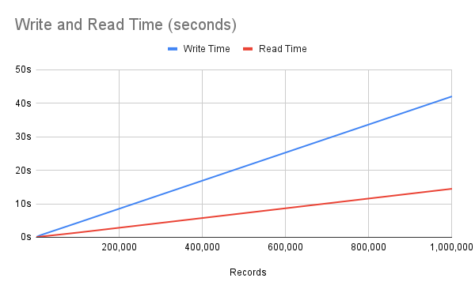

<h1 align="center">Nucleoid Data Store</h1>

<p align="center">
  <a href="https://www.apache.org/licenses/LICENSE-2.0">
    
  </a>
  <a href="https://www.npmjs.com/package/@nucleoidjs/datastore">
    
  </a>
  <a href="https://discord.com/invite/eWXFCCuU5y">
    
  </a>
</p>

[](http://nucleoid.com/)

<p align="center">
  On-Chain Data Store for JavaScript Objects
</p>

<br/>

Nucleoid Data Store persists sequent JavaScript objects with the blockchain style encryption. Each object is sequentially encrypted with each other and the data store saves those hashes in managed-files. Each transaction is completed in sub-millisecond and any changes in hashes throws an error so that the final state of objects is guaranteed, and objects cannot be visible without unchanged hashes and the key.

In event-driven architecture or CQRS, it is common to store event objects instead of storing actual state, but eventually the application has to run populate the state at boot up. This on-chain data store provides persistency in this structure with fast read and write at the same time, but requires state calculation as a trade-off.

### How is hash generated?

It uses hard-coded genesis token as a first hash in the chain. As it receives more objects, the data store uses the previous hash as well as the key to generate next hash in the chain. It uses Node.js built-in `crypto` package with a configurable algorithm.

## Hello World

Installing and initialize Nucleoid Data Store:

```javascript
const datastore = require("@nucleoidjs/datastore");

datastore.init({
  id: "datastore1",
  path: "~/.nuc/data",
  key: "0c3Yc2KDj0rQWq9aJEnOGNzsNb4IrHPq",
});
```

Writing:

```javascript
datastore.write({ test: 123 });
datastore.write({ test: 456 });
```

Reading:

```javascript
const data = datastore.read();
console.log(data);

// [{ test: 123 }, { test: 456 }]
```

Example of on-chain data in managed-files:

```
ff2024a65a339abd3c77bb069da38717:10812ca4ed497e3167684f9b0316b5cf72992adffd9ed8bd97e08f321e117daf367b012
a1a521479a43e1b16ce0ecc1671fbd8d:1ceb5211efadecc791c22a010752ecdf626764a71c4bc80c74f9d3ba6adb88d2e7cedcf
20033f1556383ce5b911436aa76381a8:543a50ae5072aa64acb0ef7c307aa53f3aaea042023704362305bedfafd721c9f918740
ee8a894958d4bb372d1a9e63335ccee7:4834d1e04e6b234135ae896c0057186df4c820b9b25fa6ce153e03f89c63b905208ba07
dc2d6d47071db41845fa8631b131bef5:0ec5427dd957ccb46fbd6884290eb0de9696102405fc606d2acf56e059ed3e827610e6a
3ef42a5927c4e231f17323619d6a60d1:e793031d12c9e5b10708c62d49a56c77fd9ef463606609036d22af83490106c213224e5
3a016c3e71238462f8b42ebb733e5856:cb1595d06424c7e1ec3c353f5eee2d6cf1b804306dcdadb09a6be9a066b89581270464d
```

## Benchmark



Ubuntu 22.04 on AWS EC2 t2.micro with [benchmark.js](benchmark.js)
